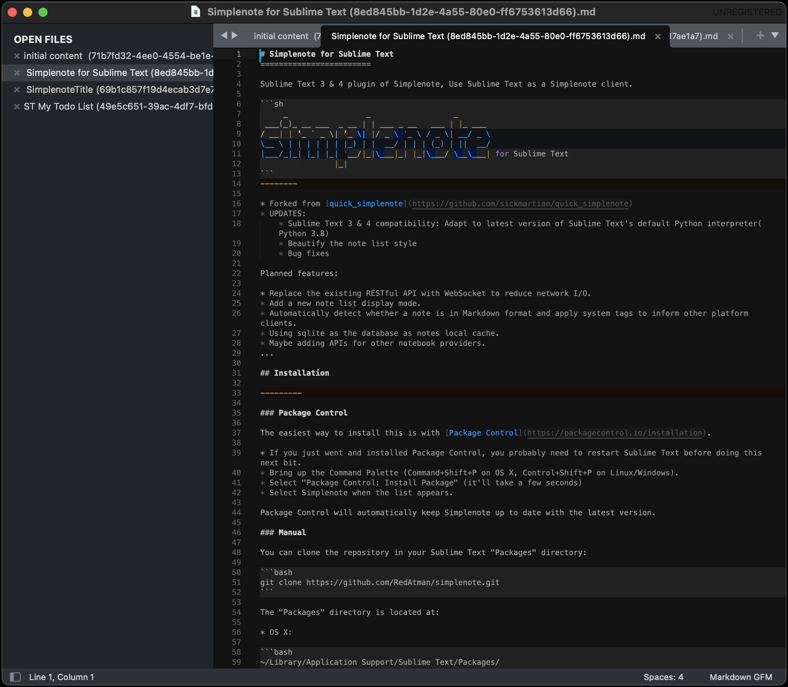

# Simplenote for Sublime Text
========================

Sublime Text 3 & 4 plugin of Simplenote, Use Sublime Text as a Simplenote client.

```sh
     _                 _                  _
 ___(_)_ __ ___  _ __ | | ___ _ __   ___ | |_ ___
/ __| | '_ ` _ \| '_ \| |/ _ \ '_ \ / _ \| __/ _ \
\__ \ | | | | | | |_) | |  __/ | | | (_) | ||  __/
|___/_|_| |_| |_| '__/|_|\___|_| |_|\___/ \__\___| for Sublime Text
                |_|
```
--------

* Forked from [quick_simplenote](https://github.com/sickmartian/quick_simplenote)
* UPDATES:
    * Sublime Text 3 & 4 compatibility: Adapt to latest version of Sublime Text's default Python interpreter(Python 3.8)
    * Bug fixes

Planned features:

* Replace the existing RESTful API with WebSocket to reduce network I/O.
* Add a new note list display mode.
* Automatically detect whether a note is in Markdown format and apply system tags to inform other platform clients.
* Using sqlite as the database as notes local cache.
* Maybe adding APIs for other notebook providers.
...

## Installation

---------

### Package Control

The easiest way to install this is with [Package Control](https://packagecontrol.io/installation).

* If you just went and installed Package Control, you probably need to restart Sublime Text before doing this next bit.
* Bring up the Command Palette (Command+Shift+P on OS X, Control+Shift+P on Linux/Windows).
* Select "Package Control: Install Package" (it'll take a few seconds)
* Select Simplenote when the list appears.

Package Control will automatically keep Simplenote up to date with the latest version.

### Manual

You can clone the repository in your Sublime Text "Packages" directory:

```bash
git clone https://github.com/RedAtman/simplenote.git
```

The "Packages" directory is located at:

* OS X:

```bash
~/Library/Application Support/Sublime Text/Packages/
# or
~/Library/Application Support/Sublime Text/Installed Packages/
```

* Linux:

```bash
~/.config/sublime-text/Packages/
# or
~/.config/sublime-text/Installed Packages/
```

* Windows:

```bash
%APPDATA%/Sublime Text/Packages/
# or
%APPDATA%/Sublime Text/Installed Packages/
```

## Configuration

---------
You need to set up your Simplenote credentials before using the plugin. You can do this by going to the menu `Preferences -> Package Settings -> Simplenote -> Settings - User` and adding your email and password:

```json
{
    "username": "your_simplenote_account_email",
    "password": "your_simplenote_account_password"
}
```

## Usage

---------

### Keyboard shortcut

| Feature             | macOS(OS X)                        | Linux                              | Windows                            |
| ------------------- | ---------------------------------- | ---------------------------------- | ---------------------------------- |
| Show Note List      | ["super+shift+s", "super+shift+l"] | ["super+shift+s", "super+shift+l"] | ["super+shift+s", "super+shift+l"] |
| Create Note         | ["super+shift+s", "super+shift+c"] | ["super+shift+s", "super+shift+c"] | ["super+shift+s", "super+shift+c"] |
| Delete Current Note | ["super+shift+s", "super+shift+d"] | ["super+shift+s", "super+shift+d"] | ["super+shift+s", "super+shift+d"] |

You can customize it: Sublime Text > Settings > Package Control > Simplenote > Key Bindings


## Overview

---------
Hit Command+Shift+S (OSX) and then Command+Shift+L (OSX) or Windows+Shift+S (Windows) and then Windows+Shift+L (Windows) to start. First time it will open the settings to setup the credentials.
After setting them it will download the notes.


Hit the shortcut again after the download is done (check the message bar) and it will **show a list of the notes**:


It will download notes every time sublime text is launched and every now and then if the _sync_interval_ configuration is enabled (has a positive value), so take a look at the bar to check the status.

If a note gets updated from somewhere else

After the next sync it will be updated on sublime as well


If you change something on sublime the note will be updated after you save the file:


You can **create a note** with Command+Shift+S and then Command+Shift+C (OSX) or Windows+Shift+S and then Windows+Shift+C (Windows), a name is assigned according to the first line of the note (remember to save!)


> Markdown syntax support: If your note begins with "# ", it will automatically be marked as markdown format and displayed accordingly.


You can **delete notes** with Command+Shift+S and then Command+Shift+D (OSX) or Windows+Shift+S and then Windows+Shift+D (Windows) while seeing the note


All those commands are also accesible from the command palette:


## Conflict Resolution

---------

If a change is made on a different client


And in the middle of that change and a sync we have made local changes in sublime


We get a dialog asking what we want to do to resolve the conflict


Selecting _Overwrite_ will discard overwrite the local changes with what the server has.

Selecting _Cancel_ instead will leave alone the local file, if you save after this the result will most likely be a merge performed by simplenote between the local data and the remote data.

There are two options that automate the conflict resolution mode: _on_conflict_use_server_ and _on_conflict_leave_alone_ for _Overwrite_ and _Cancel_ respectively.

## Beta Features

---------

The options _autosave_debounce_time_ and title_extension_map are on beta.

Uncommenting **autosave_debounce_time** makes Sublime Text behave similarly to a simplenote client, saving data after each change. The value of the option tells the plugin how much to wait after the last pressed key to save the data.

A small value might start making simplenote reject changes and a big value might make you think you saved something after closing sublime even when it wasn't saved yet.

**title_extension_map** is an array used to apply extensions to the temporal note files, so it can interact with other extensions, most notably plaintasks:


Each row of the array takes a regex that the plugin uses against the note title and an extension to add at the end.


## About your data and bugs

---------

This is a free piece of software and is distributed as is, it might contain bugs that due to the nature of the application might result in data loss, please make periodic backups of any important piece of information.

In case of data loss it might be helpful to use the real simplenote page or an official client with history capabilities to try and find the last sane version of your note.
